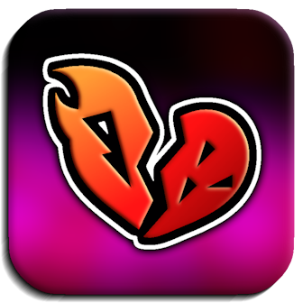

<h1> Saboteur</h1>
<h6>Spice up your gameplay with friends!</h6>

## About
**An extension to [Horrible Menu](https://geode-sdk.org/mods/cubicstudios.horriblemenu)** with features designed for multiplayer with [Globed](https://geode-sdk.org/mods/dankmeme.globed2)!

---

### Options
This mod introduces a new unique set of troll & challenge features designed for multiplayer on [Globed](https://geode-sdk.org/mods/dankmeme.globed2), for you to mess around with friends! You can find them on [Horrible Menu](https://geode-sdk.org/mods/cubicstudios.horriblemenu)'s options menu. Enjoy...

#### Setting Up
After creating a room on [Globed](https://geode-sdk.org/mods/dankmeme.globed2), you'l be prompted to synchronize all *Saboteur* options with the rest of the players in the room once they're in. You can choose to continue with the sync or skip it.

---

#### Thanks
- **[Globed](https://globed.dev/)**: Developed an API that made this mod possible!

---

---

This mod is published by <b><a href="https://www.cubicstudios.xyz/"> Cubic Studios</a></b>, on behalf of the <a href="https://breakeode.cubicstudios.xyz/"> Breakeode</a> developer team.

